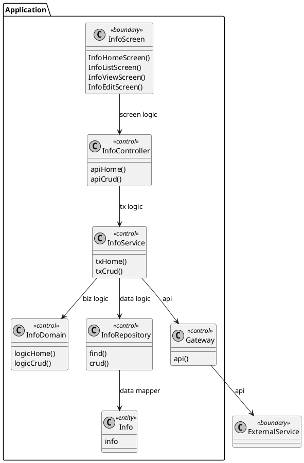
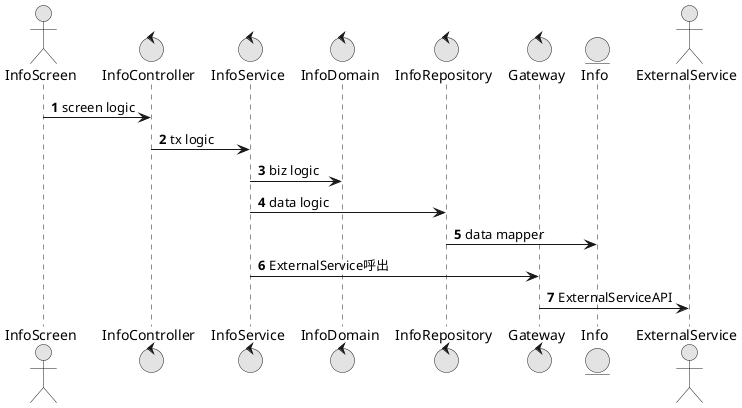

<!-- Code model -->
<!-- Class model -->

```plantuml
@startuml
skinparam monochrome true
skinparam handwritten false
skinparam defaultFontName "Yu Gothic UI, sans-serif"
package Application {
class InfoScreen <<boundary>> {
    InfoHomeScreen()
    InfoListScreen()
    InfoViewScreen()
    InfoEditScreen()
}
class InfoController <<control>> {
    apiHome()
    apiCrud()
}
class InfoService <<control>> {
    txHome()
    txCrud()
}
class InfoDomain <<control>> {
    logicHome()
    logicCrud()
}
class InfoRepository <<control>> {
    find()
    crud()
}
class Info <<entity>> {
    info
}
class Gateway <<control>> {
    api()
}
InfoScreen --> InfoController : screen logic
InfoController --> InfoService : tx logic
InfoService --> InfoDomain : biz logic
InfoService --> InfoRepository : data logic
InfoRepository --> Info : data mapper
InfoService --> Gateway : api
}
class ExternalService <<boundary>>
Gateway --> ExternalService : api
@enduml
```

---

<!-- Sequence model -->

```plantuml
@startuml
skinparam monochrome true
skinparam defaultFontName "Yu Gothic UI, sans-serif"
autonumber
actor InfoScreen
control InfoController
control InfoService
control InfoDomain
control InfoRepository
control Gateway
entity Info
actor ExternalService
InfoScreen -> InfoController : screen logic
InfoController -> InfoService : tx logic
InfoService -> InfoDomain : biz logic
InfoService -> InfoRepository : data logic
InfoRepository -> Info : data mapper
InfoService -> Gateway : ExternalService呼出
Gateway -> ExternalService : ExternalServiceAPI
@enduml
```
