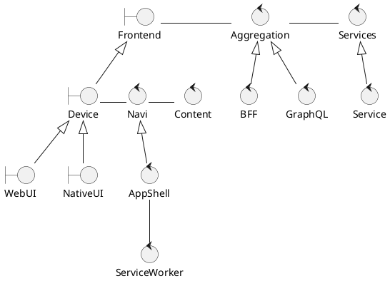

<!-- Component model -->

```plantuml
@startuml
skinparam monochrome true
skinparam handwritten false
skinparam defaultFontName "Yu Gothic UI, sans-serif"
boundary Frontend
control Aggregation
control BFF
control GraphQL
Aggregation <|-- BFF
Aggregation <|-- GraphQL
control Services
control Service
Services <|-- Service
Frontend - Aggregation
Aggregation - Services
'---
boundary Device
boundary WebUI
boundary NativeUI
Frontend <|-- Device
Device <|-- WebUI
Device <|-- NativeUI
control Navi
control AppShell
control ServiceWorker
Navi <|-- AppShell
AppShell -- ServiceWorker
control Content
Device - Navi
Navi - Content
@enduml
```
