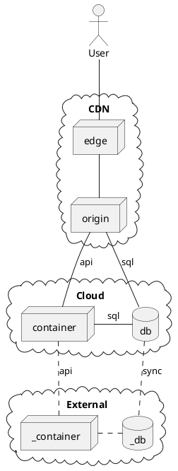

<!--  Container model -->

```plantuml
@startuml
skinparam monochrome true
skinparam handwritten false
skinparam defaultFontName "Yu Gothic UI, sans-serif"
actor User
cloud CDN {
    node edge
    node origin
}
cloud Cloud {
    node container
    database db
}
cloud External {
    node _container
    database _db
}
User -- edge
edge -- origin
origin -- container : api
origin -- db : sql
container - db : sql
container .. _container : api
db .. _db : sync
_container . _db
@enduml
```
