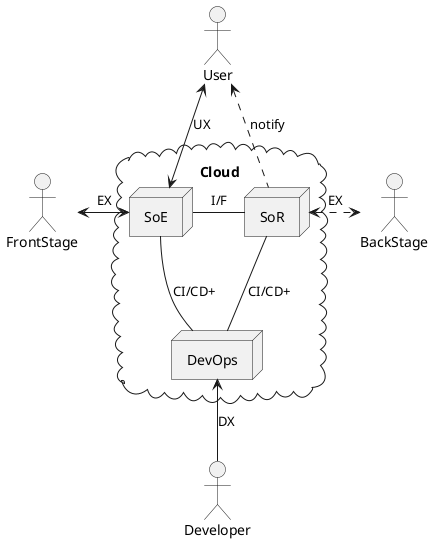

<!-- Context model -->

```plantuml
@startuml
skinparam monochrome true
skinparam handwritten false
skinparam defaultFontName "Yu Gothic UI, sans-serif"
actor User
actor FrontStage
actor BackStage
actor Developer
cloud Cloud {
    node SoE
    node SoR
    node DevOps
}
User <--> SoE : UX
User <.. SoR : notify
FrontStage <-> SoE : EX
SoR <.> BackStage : EX
SoE -- DevOps : CI/CD+
SoR -- DevOps : CI/CD+
DevOps <-- Developer : DX
SoE - SoR : I/F
@enduml
```
