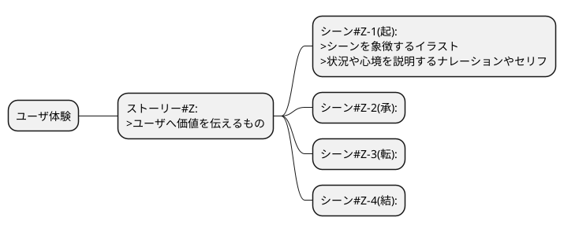

<!-- ストーリーボード -->

```plantuml
@startmindmap
skinparam monochrome true
skinparam handwritten false
skinparam defaultFontName "Yu Gothic UI, sans-serif"
* ユーザ体験
** ストーリー#Z:\n>ユーザへ価値を伝えるもの
*** シーン#Z-1(起):\n>シーンを象徴するイラスト\n>状況や心境を説明するナレーションやセリフ
*** シーン#Z-2(承):
*** シーン#Z-3(転):
*** シーン#Z-4(結):
@endmindmap
```
